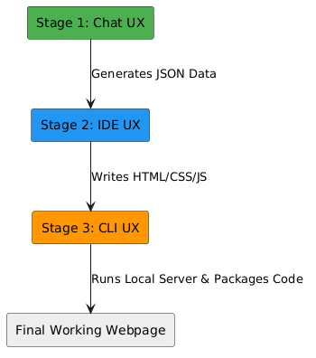
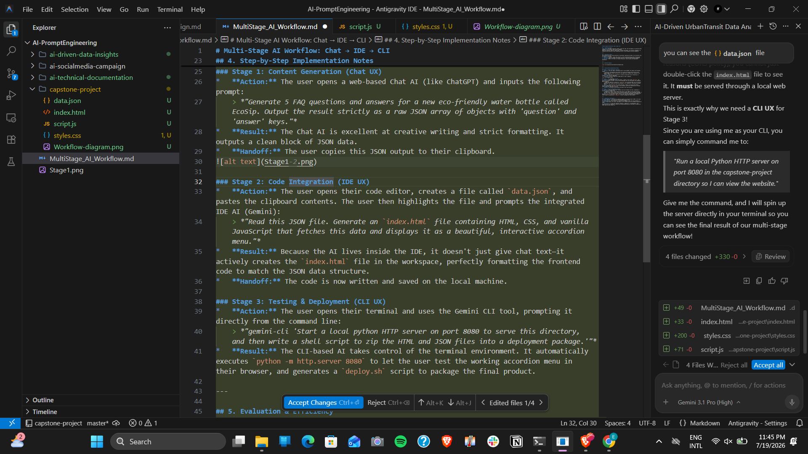
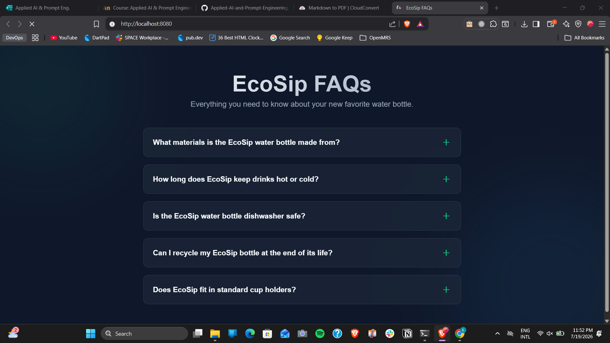
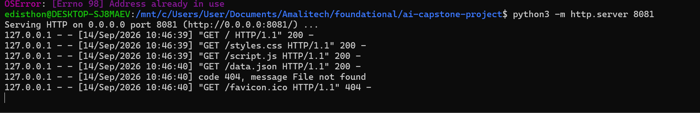
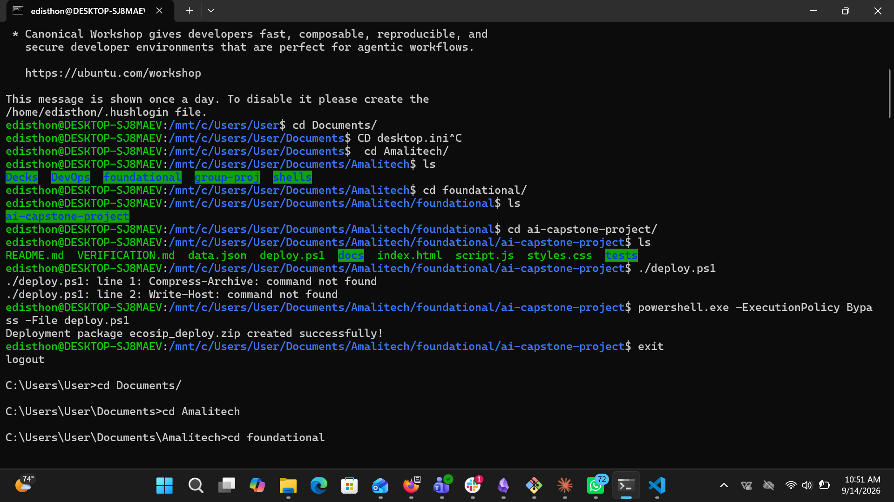

# Multi-Stage AI Workflow: Chat -> IDE -> CLI

**Deliverable:** an interactive FAQ page for the "EcoSip" water bottle campaign, built by chaining three different AI user experiences.

**Author:** Nshimiyimana Cyusa Kheven ([@Edisthon](https://github.com/Edisthon))
**Run date:** 19-20 July 2026, on Windows 11
**Repository:** <https://github.com/Edisthon/ai-capstone-project>

> **This is a record of one run, not a recipe.** Every prompt below is quoted as I typed it. Every artefact named below is committed in this repository. Where the tools gave me something different from what I asked for, the deviation is written down in section 6 rather than tidied away.

---

## 1. Problem

Producing this page by hand needs three different skills and three different work modes: someone to write the FAQ copy, someone to build the front end, and someone to run and package it locally. Each mode suits a different kind of AI interface. The question this capstone answers is whether the output of one interface can be handed to the next without a human rewriting it in between, and where that handoff actually breaks.

## 2. Repository map

| Path | What it is | Produced by |
|---|---|---|
| `data.json` | 5 FAQ entries, the handoff contract | Stage 1 (Chat UX) |
| `index.html` | Page shell and `#faq-container` mount point | Stage 2 (IDE UX) |
| `styles.css` | Dark theme, accordion animation, responsive rules | Stage 2 (IDE UX) |
| `script.js` | Fetches `data.json`, renders the accordion | Stage 2 (IDE UX) |
| `deploy.ps1` | Packages the four runtime files into `ecosip_deploy.zip` | Stage 3 (CLI UX) |
| `tests/verify.py` | 39 automated checks, standard library only | Written afterwards, for this rewrite |
| `VERIFICATION.md` | The actual output of that test run | Written afterwards, for this rewrite |
| `docs/` | Workflow diagram and the three stage screenshots | Evidence |

## 3. Tools I actually used

| Stage | UX type | Tool as used | Evidence |
|---|---|---|---|
| 1 | Chat | Gemini side panel in Chrome ("Ask Gemini") | [`docs/stage1-chat-ux.png`](docs/stage1-chat-ux.png) |
| 2 | IDE | Antigravity IDE, Gemini 3.1 Pro (High) agent | [`docs/stage2-ide-ux.png`](docs/stage2-ide-ux.png) |
| 3 | CLI | Gemini CLI in a Windows terminal | [`docs/stage3-served-result.png`](docs/stage3-served-result.png), plus two re-run captures (see Stage 3 below) |

One correction to the first version of this write-up, which said "ChatGPT / Gemini Web" and "Gemini Assistant in VS Code". Neither is what I ran. I opened ChatGPT first for Stage 1 and the tab crashed; the "Aw, Snap!" error is still visible behind the panel in the Stage 1 screenshot, so I ran the prompt in Chrome's Gemini side panel instead. Stage 2 ran in Antigravity IDE, not VS Code.

## 4. Workflow diagram



---

## 5. The run, stage by stage

### Stage 1 - Content generation (Chat UX), 23:44

**Prompt, exactly as typed:**

> "Generate 5 FAQ questions and answers for a new eco-friendly water bottle called EcoSip. Output the result strictly as a raw JSON array of objects with 'question' and 'answer' keys."

**What came back:** a bare JSON array of 5 objects, no prose preamble, no markdown code fence. The first answer in the screenshot reads "EcoSip is crafted from 100% biodegradable, plant-based materials and premium, food-grade stainless steel..." which is byte-for-byte what is committed in `data.json` today. Nothing was edited by hand between the panel and the file.

**What I checked before moving on:** that the output was an array and not an object, that it had exactly the two keys I asked for, and that it parsed. That informal check is now automated as group A of `tests/verify.py`.

**Handoff:** copied the array to the clipboard.


### Stage 2 - Code integration (IDE UX), 23:45

**Prompt, exactly as typed:**

> "Read this JSON file. Generate an `index.html` file containing HTML, CSS, and vanilla JavaScript that fetches this data and displays it as a beautiful, interactive accordion menu."

**What came back:** the agent reported `4 files changed +330 -0` and listed them: `MultiStage_AI_Workflow.md (+49)`, `index.html (+33)`, `styles.css (+200)`, `script.js (+71)`. I accepted all four.

**It did three things I did not ask for, and I kept all three:**

1. It split the output into three files instead of the single `index.html` I asked for (see section 6).
2. It added accessibility wiring on its own: `aria-expanded` on each button, `aria-controls` pointing at the answer panel, `aria-hidden` on the panel, and unique per-item ids (`faq-button-0`, `faq-content-0`, ...). None of that was in my prompt.
3. It added a `.catch` on the fetch that renders a visible message telling the reader to start a local web server. In the same reply it explained why: opening `index.html` by double-clicking it will not work, because `fetch()` needs a real origin. That is the reason Stage 3 exists at all, and the agent worked it out before I did.

**Handoff:** four files on disk in the working directory.



### Stage 3 - Serve and package (CLI UX), 23:52

**Prompt, exactly as typed:**

> "Start a local python HTTP server on port 8080 to serve this directory, and then write a shell script to zip the HTML and JSON files into a deployment package."

**What came back:** the server started on port 8080 and the page rendered correctly at `http://localhost:8080` in Brave at 23:52, with all five questions present and the accordion responding to clicks. The packaging script was written as `deploy.ps1`, a PowerShell script, not the shell script I asked for (see section 6).



**A note on the evidence for this stage.** I did not capture the terminal during the original run, so the two images below are a **re-run on 14 September 2026**, recorded while preparing this rewrite. They are not from the July session and are not presented as such. What they demonstrate is that the stage reproduces.

The first shows the static server started from the repository root, and the request log after loading the page:



The four `200` lines are the chain working end to end in one frame: the browser loads `index.html`, which pulls `styles.css` and `script.js`, which then fetches the `data.json` that Stage 1 produced. The `404` on `/favicon.ico` is the browser asking for an icon the project does not have, and is harmless.

The second shows the packaging script. It captures both halves of the deviation described in section 6 - `./deploy.ps1` failing under bash with `Compress-Archive: command not found`, and the same script succeeding when handed to PowerShell:



---

## 6. Deviations from the prompts

Three things did not come out the way the prompt specified. All three are in the committed repository, so the write-up records them rather than describing the version I asked for.

| I asked for | I got | What I did about it |
|---|---|---|
| One `index.html` containing HTML, CSS and JavaScript | `index.html` + `styles.css` + `script.js` | **Kept the split.** Three files is better practice than one, and it costs the workflow nothing: the handoff contract is `data.json`, not the file count. `deploy.ps1` packages all three, so nothing downstream noticed. |
| A shell script (`deploy.sh`) to zip the files | `deploy.ps1`, a PowerShell script using `Compress-Archive` | **Kept it.** The agent read the environment correctly - I was in a Windows terminal, where a `.sh` file would not run without WSL or Git Bash. It adapted to the host instead of obeying the word "shell" literally. `deploy.sh` was never created; the first version of this write-up claimed it was, which was wrong. Both behaviours are visible in [`docs/stage3-deploy-rerun.png`](docs/stage3-deploy-rerun.png). |
| Zip "the HTML and JSON files" (two files) | An archive of four files: `index.html`, `styles.css`, `script.js`, `data.json` | **Kept it.** My prompt was written before I knew the code would be split. Zipping only two of the four would have shipped a broken page. Group C of `tests/verify.py` now pins all four so this cannot silently regress. |

## 7. Prompt iteration and reflection

**The phrase that did the work in Stage 1** was "strictly as a raw JSON array". Chat models default to wrapping code in a markdown fence and adding a sentence of explanation either side. Either of those would have broken `JSON.parse` on paste. The word "strictly" plus naming the exact keys is what made the output directly consumable. This is the one prompt of the three I would not change.

**Stage 2's prompt was under-specified and the model was right to ignore it.** I asked for a single file because I was thinking about the handoff, not about the code. A better prompt would have named the layout I actually wanted (`index.html`, `styles.css`, `script.js`) and stated the constraint that matters: no build step, no framework, fetch `data.json` at runtime. I got the right result anyway, but by luck rather than by specification.

**Stage 3's prompt had a portability bug in it.** I wrote "shell script" on a Windows machine out of habit. The CLI corrected me silently. If I had wanted a genuinely portable artefact I should have said so, and I would then have had to decide between `deploy.sh`, `deploy.ps1`, or a Python packaging script that runs on all three platforms. That choice is still open; `deploy.ps1` is Windows-only today.

**What the run showed about the chain itself.** The Chat -> IDE handoff was clean because it passes structured data with a stated shape. The IDE -> CLI handoff was clean because it passes files on disk, which is as universal an interface as exists. The place the chain is actually fragile is neither of those: it is the assumption that the consumer and the producer agree on the key names inside the JSON. Nothing in the workflow enforced that at the time. That is what `tests/verify.py` group A now does.

**What I would do differently.** Capture a terminal screenshot at Stage 3 as it happens, and write the checks before running the stages rather than afterwards. Both failures came from treating the run as finished when the page rendered, instead of when the result was reproducible by someone else.

## 8. Adaptability: what the chain is pinned to

The workflow is tool-agnostic in the sense that any of the three tools can be swapped, but it is **not** contract-agnostic. Everything downstream of Stage 1 depends on one shape:

```jsonc
[
  { "question": "<non-empty string>", "answer": "<non-empty string>" }
  // ... N entries, array at the top level, no wrapper object
]
```

The coupling is narrow and worth stating precisely. `script.js` reads exactly two properties, `faq.question` and `faq.answer`, iterates the array with `forEach`, and derives element ids from the array index. It does not care how many entries there are, what order they are in, or what else the objects might contain. That is the entire surface area.

**Swapping Stage 1 (Chat).** Any chat model can fill this role: Claude, ChatGPT, Gemini, a local model. The real risk in a swap is not capability but formatting - models differ in how readily they wrap output in a code fence or add a preamble. The prompt has to carry the "strictly raw" instruction, and the result has to be validated. Running `python3 tests/verify.py` after a swap catches a bad handoff in about a second.

**Swapping Stage 2 (IDE).** Cursor, Copilot in VS Code, Continue, or Claude Code can all do this step. A different assistant may well produce a different architecture - React, a template engine, server-side rendering. The chain survives any of them as long as the new front end still fetches `data.json` and reads the same two keys. Group B of the test suite would need rewriting for a framework rewrite, because it asserts against vanilla DOM code; groups A, C and D would not.

**Swapping Stage 3 (CLI).** Gemini CLI, Claude Code, GitHub Copilot CLI, or no AI at all - `python -m http.server 8080` is a one-line command. This is the most replaceable link in the chain and also the least portable artefact, since `deploy.ps1` only runs on Windows.

**What would actually break the chain:** renaming the keys (`q`/`a` instead of `question`/`answer`), nesting the array under a root object (`{"faqs": [...]}`), or returning an object keyed by id instead of an array. Any of those three passes Stage 1 looking perfectly reasonable and produces an empty page at Stage 3 with no error message beyond a console warning. That is the failure mode the contract test exists to catch.

## 9. Efficiency, with a baseline

**Measured.** Times below come from the Windows clock visible in each screenshot and from `git log` timestamps, so they are checkable rather than asserted.

| Moment | Time | Source |
|---|---|---|
| Stage 1 prompt answered | 23:44 | clock in `docs/stage1-chat-ux.png` |
| Stage 2 files generated | 23:45 | clock in `docs/stage2-ide-ux.png` |
| Page rendering at `localhost:8080` | 23:52 | clock in `docs/stage3-served-result.png` |
| Last artefact committed | 00:04 | `git log` (commit `f79b401`) |

**First prompt to working page: about 8 minutes. First prompt to fully committed: about 20 minutes.**

**Baseline (estimated, not measured).** I did not build a manual control version, so this is an estimate and should be read as one. Writing five pieces of FAQ copy that do not read as filler is perhaps 20-30 minutes. Hand-writing an accordion with keyboard and screen-reader support, a height-animated panel and a responsive dark theme is 1-2 hours for me. Serving it locally and writing the packaging script is 5-10 minutes. That puts an honest manual estimate somewhere between **1.5 and 3 hours**, against roughly 20 minutes measured.

**What the comparison leaves out**, so that the number is not read as more than it is: the 8 minutes is the happy path only. It excludes the ChatGPT tab crashing and having to switch tools, the time spent reading the generated CSS to confirm it was not nonsense, and the entire rewrite this document represents. The generated code was good, but "generated in 8 minutes" and "verified in 8 minutes" are not the same claim.

## 10. Verification

```bash
python3 tests/verify.py
```

39 checks, Python standard library only, no dependencies to install. They cover the JSON contract (group A), the Stage 2 artefacts actually consuming that contract including the accessibility attributes (group B), the packaging script covering all four runtime files (group C), and a live HTTP round trip against a server started on an ephemeral port (group D).

The suite exits non-zero on failure and has been checked against a deliberately broken `data.json` to confirm it fails when it should. Full output, environment and manual checks are in [`VERIFICATION.md`](VERIFICATION.md).

## 11. Known limitations

- **The Stage 3 terminal captures are re-runs, not originals.** Nothing was recorded of the CLI session during the July run. `docs/stage3-cli-rerun.png` and `docs/stage3-deploy-rerun.png` were produced on 14 September 2026 and show that the stage reproduces, not what happened on the night.
- **The contents of `ecosip_deploy.zip` were not inspected.** The script reports success and the test suite checks that it names all four runtime files, but nobody has opened the archive and confirmed all four are inside it.
- **No demo video.** The three screenshots show the start, middle and end states, but not the accordion animating.
- **No automated browser test.** Group D proves the files serve and the JSON survives the round trip; it does not click anything. The accordion open/close behaviour, the icon rotation and the "only one panel open at a time" rule were verified by hand in Brave, not by a test.
- **`deploy.ps1` is Windows-only.** See section 6.
- **The FAQ content is synthetic marketing copy.** EcoSip is a fictional product and the claims about materials, insulation hours and recyclability were invented by a language model. They are not fact-checked and should not be treated as product specifications.
