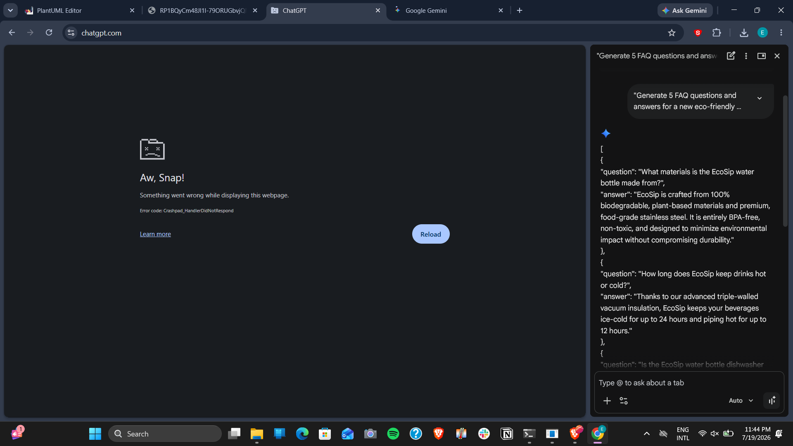

# Multi-Stage AI Workflow: Chat → IDE → CLI

## 1. Problem Statement
**The Task:** We need to generate content, build the code, and test/deploy an interactive FAQ webpage for the "EcoSip" water bottle campaign. 
Doing this manually requires copywriting, frontend development, and terminal management. By chaining three different AI User Experiences (UX), we can automate the entire pipeline.

---

## 2. Selected AI Tools
This workflow utilizes three different AI interfaces, passing the output of one directly into the input of the next:
1. **Chat UX:** ChatGPT / Gemini Web (Used for initial brainstorming and data structuring)
2. **IDE UX:** Gemini Assistant in VS Code (Used for writing and formatting the codebase)
3. **CLI UX:** Gemini CLI (Used for terminal execution, local testing, and deployment automation)

---

## 3. Workflow Diagram

---

## 4. Step-by-Step Implementation Notes

### Stage 1: Content Generation (Chat UX)
*   **Action:** The user opens a web-based Chat AI (like ChatGPT) and inputs the following prompt:
    > *"Generate 5 FAQ questions and answers for a new eco-friendly water bottle called EcoSip. Output the result strictly as a raw JSON array of objects with 'question' and 'answer' keys."*
*   **Result:** The Chat AI is excellent at creative writing and strict formatting. It outputs a clean block of JSON data. 
*   **Handoff:** The user copies this JSON output to their clipboard.

### Stage 2: Code Integration (IDE UX)
*   **Action:** The user opens their code editor, creates a file called `data.json`, and pastes the clipboard contents. The user then highlights the file and prompts the integrated IDE AI (Gemini):
    > *"Read this JSON file. Generate an `index.html` file containing HTML, CSS, and vanilla JavaScript that fetches this data and displays it as a beautiful, interactive accordion menu."*
*   **Result:** Because the AI lives inside the IDE, it doesn't just give chat text—it actively creates the `index.html` file in the workspace, perfectly formatting the frontend code to match the JSON data structure.
*   **Handoff:** The code is now written and saved on the local machine.

### Stage 3: Testing & Deployment (CLI UX)
*   **Action:** The user opens their terminal and uses the Gemini CLI tool, prompting it directly from the command line:
    > *"gemini-cli 'Start a local python HTTP server on port 8080 to serve this directory, and then write a shell script to zip the HTML and JSON files into a deployment package.'"*
*   **Result:** The CLI-based AI takes control of the terminal environment. It automatically executes `python -m http.server 8080` to let the user test the working accordion menu in their browser, and generates a `deploy.sh` script to package the final product.1

---

## 5. Evaluation & Efficiency
*   **Functionality:** The workflow seamlessly hands off structured data (JSON) to the code generator (HTML/JS), and finally to the environment manager (CLI).
*   **Adaptability:** This workflow is entirely tool-agnostic. You could swap ChatGPT for Claude, VS Code Gemini for Cursor, and Gemini CLI for GitHub Copilot CLI without breaking the chain.
*   **Efficiency:** A task that typically requires a copywriter, a web developer, and a DevOps process was completed in minutes by allowing specialized AI interfaces to handle the tasks they are best suited for.
